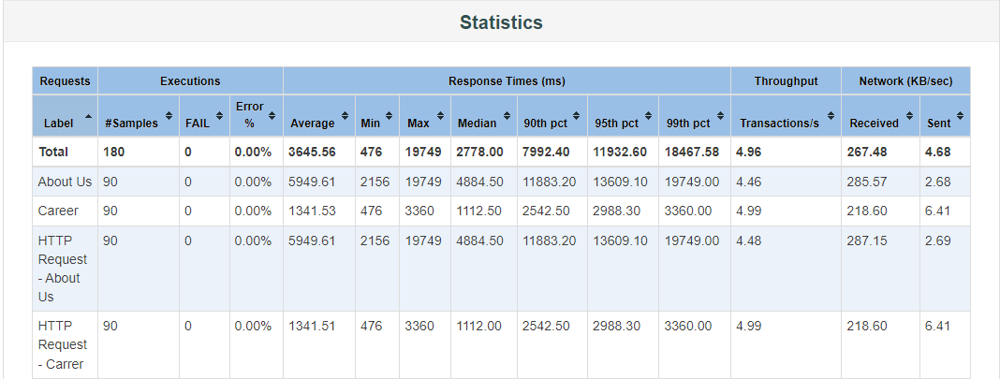
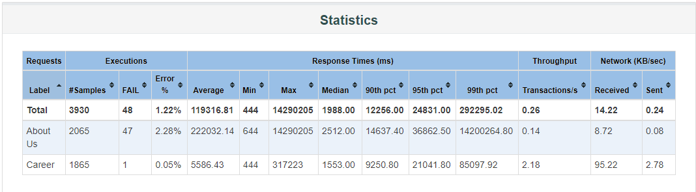

# BanglaPuzzle Performance Test (Unofficial)

This repository contains performance testing scripts and documentation for purely testing purposes on the BanglaPuzzle website. Please note that this testing is not affiliated with BanglaPuzzle, and no malicious intent is involved.

## Overviewe 
This project aims to assess the performance of the BanglaPuzzle website under various load conditions. We have conducted the following types of performance tests:

- **Load Test:** Simulates concurrent website user access to measure response time and throughput.

- **Stress Test:** Pushes the system to its limits to identify breaking points and measure performance degradation under extreme loads.

- **Endurance Test:** Evaluate the system's performance over an extended period to check for memory leaks, resource exhaustion, or gradual performance degradation.

- **Spike Test:** Simulates sudden spikes in user traffic to assess how the system handles rapid increases in load.

## Setup

1. Install Java 

2. Install JMeter by following the instructions on the [official website](https://jmeter.apache.org/)

3. Clone this repository 
4. Open JMeter and load the test plan located in the `jmx_files` directory
5. Configure JMeter properties and variables as needed
6. Execute the test plan and monitor the results

## Contents
- [API Collection](#api-collection)
- [Report Geneation](#report-generation)
- [Load Test](#load-test)
  1. [Test Plan for Load Test ](#test-plan-for-load-test) 
  2. [Load Test Result Analysis](#load-test-result-analysis)
  3. [Load Test Verdict](#load-test-verdict)
- [Stress Test](#stress-test)
  1. [Test Plan for Stress Test](#test-plan-for-stress-test) 
  2. [ Stress Test Result Analysis ](#stress-test-result-analysis)
  3. [Stress Test Verdict](#stress-test-verdict)
- [Endurance Test](#endurance-test)
  1. [Test Plan for Endurance Test](#test-plan-for-endurance-test) 
  2. [Endurance Test Result Analysis ](#endurance-test-result-analysis)
  3. [Endurance Test Verdict](#endurance-test-verdict)
- [Spike Test](#spike-test)
  1. [Test Plan for Spike Test](#test-plan-for-spike-test) 
  2. [Spike Test Result Analysis ](#spike-test-result-analysis)
  3. [Spike Test Verdict](#spike-test-verdict)

## API Collection

Throughout this performance testing, we worked with the same API collection.
### List of API 
 - [www.banglapuzzle.com/about](https://www.banglapuzzle.com/about) 
 - [www.banglapuzzle.com/career](https://www.banglapuzzle.com/career)

### Report Generation
Report Generation will be the same procedure for each test. We will use the non-GUI option/command prompt to create a report.

 *Run these commands from the bin folder of the jmeter installation folder.*
 
Creating .jtl file:  
`jmeter -n -t jmx_filepath -l jtl_filepath` 
\
Creating Report:  
`jmeter -g jtl_filepath -o report_folder` 

Run the first command for each jmx script to generate a jtl file and run the second command to generate a report with created jtl file from the first command.    
Example:
Creating a jtl file from endurance testing  
`jmeter -n -t jmx_files\Endurance_Testing\endurance.jmx -l jtl_files\Endurance_Testing\endurance.jtl`

`jmeter -g jtl_files\Endurance_Testing\endurance.jtl -o Reports\Endurance_Testing\endurance`
## Load Test

  
### Test Plan for Load Test
Testplan > Add > Threads (Users) > Thread Group 

- Name: Users
- Number of Threads (users): 30, 60, 90, 110 and 120
- Ramp-Up Period (in seconds): 10
- Loop Count: 1  

1. The general configuration for executing tests, including whether Thread Groups run concurrently or sequentially, is defined within the Test Plan section.

2. HTTP Requests inherit certain default settings from the HTTP Request item, such as the Server IP, Port Number, and Content-Encoding.

3. Each Thread Group specifies the execution parameters for HTTP Requests. To determine the number of concurrent "users" to simulate, you first need to know the number of threads. The loop count dictates how many actions each "user" will undertake.

4. Within Thread Groups, the HTTP Header Manager is positioned as the initial item. It allows you to furnish Request Headers that the subsequent HTTP Requests will utilize.

### Load Test Report Generation
See [Report Generation](#report-generation) section to  create a jtl  file and generate the report.

### Load Test Result Analysis 
| Concurrent Request  | Loop Count | Avg TPS for Total Samples  | Error Rate | Total Concurrent API request |
|               :---: |      :---: |                      :---: |                        :---: |      :---: |
| 30  | 1 | 2.28  | 0.00%      | 60   |
| 60  | 1  |  4.25     | 0.00%      | 120  |
| 90  |  1 |  4.96   | 0.00%   | 180   |
| 110  | 1  |  5.12  | 0.00%   | 220  |
| 120  | 1  |  2.48  | 0.42%   | 240 |

Thread Number: 30

| Request Summary | Statistics |
| :-------------: | :--------: |
|  |  |

##### Thread Number: 60

| Request Summary | Statistics |
| :-------------: | :--------: |
|  |  |

##### Thread Number: 90

| Request Summary | Statistics |
| :-------------: | :--------: |
|  |  |

##### Thread Number: 110

| Request Summary | Statistics |
| :-------------: | :--------: |
|  |  |

##### Thread Number: 120

| Request Summary | Statistics | Error |
| :-------------: | :--------: | :---: |
|  |  |      |

### Load Test Verdict
- During the execution of 120 concurrent requests, it was observed that only one request experienced a connection timeout, resulting in an error rate of 0.42%.
- Server can handle almost 220 concurrent API calls with almost zero (0) error rate.
  
## Stress Test

### Test Plan for Stress Test
This test starts within  the load limit and gradually increases the thread number beyond its capacity. 
We started with ten threads and created five threads every 5 seconds until we reached 130. We then held the load for 60 seconds and  terminated 20 threads every 10 seconds.
##### Graphical demonstration of threads input 

### Report Generation
See [Report Generation](#report-generation) section to  create a jtl  file and generate the report.
### Stress Test Result Analysis 
| Request Summary | Statistics | Error |
| :-------------: | :--------: | :---: |
|  |  |      |

### Stress Test Verdict
The server response times were high, around 100-115 threads,  but the average response time became lower as the thread terminated and load became gradually more normal. Also, the error occurred when the thread limit was higher than 110. 

## Endurance Test

### Test Plan for Endurance Test
This test was executed with 0 threads and  created one thread every second until it reached 30. The load was within the server's capability. After reaching the desired thread number, the load was held for 13 minutes. After holding the load for 13 minutes, one thread was terminated every second.  *[Note: Although the thirteen-minute duration may not fully qualify as an endurance test, it was limited due to resource constraints.]* 
##### Graphical demonstration of threads input 

### Endurance Test Report Generation
See [Report Generation](#report-generation) section to  create a jtl  file and generate the report.

### Endurance Test Result Analysis 

| Request Summary | Statistics |
| :-------------: | :--------: |
|  |  |

### Endurance Test Verdict
During the  endurance testing phase, the server overall exhibited good performance. It demonstrated remarkable stability and consistent response times over the  testing period, reaffirming its reliability under sustained loads. There was some sudden spike in response time. Still, its most probable cause was resource exhaustion. Despite this, the  level of endurance excellence assures us of the server's capacity to meet the demands of real-world usage scenarios and underscores its suitability for our critical applications.

## Spike Test
### Test Plan for Spike Test 
The test aimed to assess the server's responsiveness when subjected to a sudden, brief increase in load. To replicate this scenario, we initially initiated ten threads, maintained the load for 2 minutes, and then promptly terminated the threads within the subsequent 30 seconds. Concurrently, we generated 40 new threads and launched them after the initial set's holding period. This procedure generated typical loads. Subsequently, we introduced 90 threads with no ramp-up period and sustained this load briefly. This sudden, intense load created a spike, followed by a return to the usual number of threads. Another spike, consisting of 80 threads, was introduced, followed by a return to the typical load.
##### Graphical demonstration of threads input 

### Spike Test Report Generation
See [Report Generation](#report-generation) section to  create a jtl  file and generate the report.
### Spike Test Result Analysis 
| Request Summary | Statistics |
| :-------------: | :--------: |
|  |  |
### Spike Test Verdict
During the spike, the servers remained stable and were able to send responses without interruption.
  
